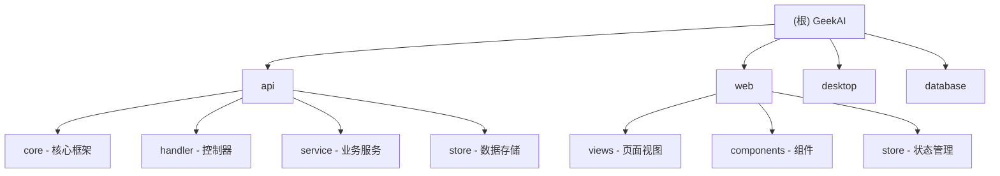

# GeekAI - AI 对话系统

> 最后更新: 2026-02-07 16:01:46

## 项目愿景

GeekAI 是一个基于 AI 大语言模型 API 实现的 AI 助手全套开源解决方案，自带运营管理后台，开箱即用。集成了 OpenAI, Claude, 通义千问, Kimi, DeepSeek, Gitee AI 等多个平台的大语言模型，以及 MidJourney、Stable Diffusion、DALL-E 等 AI 绘画功能，Suno 音乐生成，Luma/可灵视频生成等多媒体能力。

**核心特性:**
- 完整的开源系统（前端 + 后端 + 管理后台）
- 基于 WebSocket 的实时对话体验
- 多模型支持（OpenAI, Claude, DeepSeek, Kimi 等）
- AI 绘画集成（MidJourney, SD, DALL-E）
- AI 音乐生成（Suno）
- AI 视频生成（Luma, 可灵）
- 完整的支付系统（支付宝、微信、虎皮椒等）
- 会员与算力管理系统

## 架构总览

```
geekai/
├── api/          # Go 后端服务 (Gin + GORM + FX)
├── web/          # Vue3 前端应用 (Element Plus + Vant)
├── desktop/      # Electron 桌面客户端
└── database/     # 数据库脚本与迁移文件
```

**技术栈:**
- **后端**: Go 1.21+, Gin, GORM, FX (依赖注入), Redis, MySQL
- **前端**: Vue 3, Element Plus (PC), Vant (移动端), Pinia, TailwindCSS
- **桌面**: Electron
- **部署**: Docker, Docker Compose

## 模块结构图



## 模块索引

| 模块 | 路径 | 语言 | 框架 | 职责 |
|------|------|------|------|------|
| 后端服务 | [api/](./api/CLAUDE.md) | Go | Gin + GORM + FX | API 服务、业务逻辑、数据持久化 |
| 前端应用 | [web/](./web/CLAUDE.md) | Vue3/JS | Element Plus + Vant | 用户界面、PC端与移动端适配 |
| 桌面客户端 | [desktop/](./desktop/CLAUDE.md) | JS | Electron | 桌面应用封装 |
| 数据库 | database/ | SQL | MySQL | 数据库 Schema 与迁移脚本 |

## 运行与开发

### 环境要求

- Go 1.21+
- Node.js 16+
- MySQL 5.7+ / 8.0+
- Redis 6.0+

### 后端启动

```bash
cd api
cp config.sample.toml config.toml
# 编辑 config.toml 配置数据库等信息
go run main.go
# 或使用 Make 构建
make amd64  # Linux AMD64
make arm64  # Linux ARM64
```

### 前端启动

```bash
cd web
npm install
npm run dev    # 开发模式
npm run build  # 生产构建
```

### 桌面客户端

```bash
cd desktop
npm install
npm start      # 开发运行
npm run package  # 打包
```

### Docker 部署

项目支持 Docker 部署，详见官方文档: https://docs.geekai.me

## 测试策略

| 模块 | 测试类型 | 覆盖情况 |
|------|----------|----------|
| api | 单元测试 | 有限 (1 个测试文件) |
| web | 前端测试 | 暂无 |
| desktop | E2E 测试 | 暂无 |

**测试运行:**
```bash
cd api
go test ./...
```

## 编码规范

### Go 后端
- 使用 FX 依赖注入框架
- Handler -> Service -> Store 分层架构
- Model 定义在 `store/model/` 目录
- 使用 GORM 作为 ORM

### Vue 前端
- 组件文件使用 PascalCase 命名
- 使用 Pinia 进行状态管理
- PC 端使用 Element Plus，移动端使用 Vant
- 支持深色/浅色主题切换

### Commit 类型
- `feat`: 新特性或功能
- `fix`: 缺陷修复
- `docs`: 文档更新
- `style`: 代码风格或组件样式更新
- `refactor`: 代码重构
- `opt`: 性能优化
- `chore`: 小改动（修改文字、注释等）

## AI 使用指引

### 代码修改建议

1. **后端修改**:
   - 新增 API 时在 `main.go` 中注册路由
   - 新增 Handler 放在 `handler/` 或 `handler/admin/`
   - 新增 Service 放在 `service/`
   - 数据模型放在 `store/model/`

2. **前端修改**:
   - 新增页面在 `web/src/views/`
   - 新增组件在 `web/src/components/`
   - 路由配置在 `web/src/router.js`
   - HTTP 请求使用 `web/src/utils/http.js`

3. **配置修改**:
   - 后端配置: `api/config.toml` (参考 `config.sample.toml`)
   - 前端环境变量: `.env` 文件

### 关键文件速查

| 用途 | 路径 |
|------|------|
| 后端入口 | `api/main.go` |
| 后端配置 | `api/config.sample.toml` |
| 前端入口 | `web/src/main.js` |
| 前端路由 | `web/src/router.js` |
| 数据模型 | `api/store/model/*.go` |
| API Handler | `api/handler/*.go` |
| 管理后台 Handler | `api/handler/admin/*.go` |

---

## 变更记录 (Changelog)

### 2026-02-07 (初始化)
- 创建项目架构文档
- 识别 4 个主要模块: api, web, desktop, database
- 扫描覆盖率: 85%
