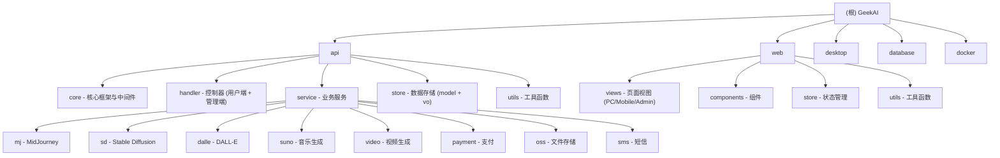

# GeekAI - AI 对话系统

> 最后更新: 2026-02-21 23:00:18

## 项目愿景

GeekAI 是一个基于 AI 大语言模型 API 实现的 AI 助手全套开源解决方案，自带运营管理后台，开箱即用。集成了 OpenAI, Claude, 通义千问, Kimi, DeepSeek, Gitee AI 等多个平台的大语言模型，以及 MidJourney、Stable Diffusion、DALL-E 等 AI 绘画功能，Suno 音乐生成，Luma/可灵视频生成等多媒体能力。

**核心特性:**
- 完整的开源系统（前端 + 后端 + 管理后台）
- 基于 WebSocket 的实时对话体验
- 多模型支持（OpenAI, Claude, DeepSeek, Kimi 等）
- AI 绘画集成（MidJourney, SD, DALL-E）
- AI 音乐生成（Suno）
- AI 视频生成（Luma, 可灵）
- OpenAI Realtime API 语音对话
- 完整的支付系统（支付宝、微信、虎皮椒、GeekPay 等）
- 会员与算力管理系统
- AI 提示词生成（歌词、绘画指令、视频指令）
- 思维导图生成（MarkMap）

## 架构总览

```
geekai/
├── api/          # Go 后端服务 (Gin + GORM + FX)
├── web/          # Vue3 前端应用 (Element Plus + Vant)
├── desktop/      # Electron 桌面客户端
├── database/     # 数据库脚本与迁移文件
├── docker/       # Docker 部署配置 (生产环境)
├── conf/         # 运行时配置文件
├── config/       # 额外配置
└── data/         # MySQL 初始化数据
```

**技术栈:**
- **后端**: Go 1.21+ (toolchain 1.22.4), Gin v1.9.1, GORM v1.25.1, FX v1.19.3 (依赖注入), Redis, MySQL 8.0, LevelDB
- **前端**: Vue 3.2+, Element Plus 2.4+ (PC), Vant 4.5+ (移动端), Pinia 2.1+, TailwindCSS 3.4+, Axios, ECharts 5.5+, Stylus
- **桌面**: Electron 26+
- **部署**: Docker, Docker Compose, Nginx (反向代理), Apache Tika (文档解析)

## 模块结构图



## 模块索引

| 模块 | 路径 | 语言 | 框架 | 文件数 | 职责 |
|------|------|------|------|--------|------|
| 后端服务 | [api/](./api/CLAUDE.md) | Go | Gin + GORM + FX | 158 | API 服务、业务逻辑、数据持久化 |
| 前端应用 | [web/](./web/CLAUDE.md) | Vue3/JS | Element Plus + Vant | 106 Vue + 25 JS | 用户界面、PC端/移动端/管理后台 |
| 桌面客户端 | [desktop/](./desktop/CLAUDE.md) | JS | Electron | 3 | 桌面应用封装 |
| 数据库 | database/ | SQL | MySQL 8.0 | ~40 | 数据库 Schema 与版本迁移脚本 |
| Docker 部署 | docker/ | YAML/Nginx | Docker Compose | 2 | 生产环境部署配置 |

## 运行与开发

### 环境要求

- Go 1.21+ (推荐 1.22.4)
- Node.js 18+ (构建使用 node:18-alpine)
- MySQL 8.0+
- Redis 6.0+ / 7.0+
- Apache Tika (可选，用于文档解析)

### 后端启动

```bash
cd api
cp config.sample.toml config.toml
# 编辑 config.toml 配置数据库、Redis 等信息
go run main.go

# 环境变量:
# CONFIG_FILE=config.toml   指定配置文件路径
# APP_DEBUG=true             开启调试模式

# 编译构建
make amd64  # Linux AMD64
make arm64  # Linux ARM64
```

### 前端启动

```bash
cd web
npm install      # 或 pnpm install
npm run dev      # 开发模式 (端口 8888, 热重载)
npm run build    # 生产构建 (输出到 dist/)
npm run lint     # 代码检查
```

**环境变量** (`.env` 或 `.env.local`):
```bash
VUE_APP_API_HOST=http://localhost:5678  # 后端 API 地址
```

### 桌面客户端

```bash
cd desktop
npm install
npm start      # 开发运行
npm run package  # 打包 (输出到 dist/)
```

### Docker 部署

**方式一：本地构建 (根目录 docker-compose.yaml)**
```bash
docker-compose up -d
# 服务端口: API=8097, Web=8096, MySQL=3306, Redis=6379, Tika=9998
```

**方式二：生产镜像 (docker/docker-compose.yaml)**
```bash
cd docker
docker-compose up -d
# 使用预构建镜像，含 Nginx 反向代理
```

**Docker 服务架构:**
| 服务 | 端口映射 | 说明 |
|------|----------|------|
| geekai-mysql | 3306:3306 | MySQL 8.0 |
| geekai-redis | 6379:6379 | Redis |
| geekai-tika | 9998:9998 | Apache Tika (可选) |
| geekai-api | 8097:5678 | 后端 API |
| geekai-web | 8096:8080 | 前端 (Nginx) |

## 测试策略

| 模块 | 测试类型 | 覆盖情况 |
|------|----------|----------|
| api | 单元测试 | 有限 (1 个测试文件 `test/crawler_test.go`, 1 个辅助 `test/test.go`) |
| web | 前端测试 | 暂无 |
| desktop | E2E 测试 | 暂无 |

**测试运行:**
```bash
cd api
go test ./...
# 运行特定测试
go test -v ./test/...
```

## 编码规范

### Go 后端
- 使用 FX 依赖注入框架管理所有依赖
- Handler -> Service -> Store 三层分层架构
- Model 定义在 `store/model/` 目录，VO (View Object) 定义在 `store/vo/`
- 使用 GORM 作为 ORM，支持自动迁移 (`MigrationService`)
- 中间件链: CORS -> 静态资源 -> JWT 授权 -> 参数处理 -> 异常恢复
- 用户端 API 使用 `Authorization` 头，管理端使用 `Admin-Authorization` 头

### Vue 前端
- 组件文件使用 PascalCase 命名
- 使用 Pinia 进行状态管理
- PC 端使用 Element Plus，移动端使用 Vant
- 支持深色/浅色主题切换 (通过 `data-theme` 属性)
- 样式使用 Stylus 预处理 + TailwindCSS
- HTTP 请求统一通过 `utils/http.js` (基于 Axios)
- 开发端口 8888，静态资源代理到 API 服务

### Commit 类型
- `feat`: 新特性或功能
- `fix`: 缺陷修复
- `docs`: 文档更新
- `style`: 代码风格或组件样式更新
- `refactor`: 代码重构
- `opt`: 性能优化
- `chore`: 小改动（修改文字、注释等）

## AI 使用指引

### 代码修改建议

1. **后端修改**:
   - 新增 API: 在 `handler/` 创建 Handler -> 在 `main.go` 中 `fx.Provide` 注册 -> 在 `main.go` 中 `fx.Invoke` 注册路由
   - 新增 Service: 在 `service/` 创建服务 -> 在 `main.go` 中 `fx.Provide` 注册
   - 新增数据模型: 在 `store/model/` 添加结构体 -> 在 `store/vo/` 添加视图对象 -> 在 `service/migration_service.go` 添加自动迁移
   - 管理后台 Handler: 放在 `handler/admin/` 目录

2. **前端修改**:
   - 新增页面在 `web/src/views/`
   - 新增组件在 `web/src/components/`
   - 路由配置在 `web/src/router.js`
   - HTTP 请求使用 `web/src/utils/http.js` 的 `httpGet`/`httpPost`
   - 移动端页面放在 `web/src/views/mobile/`
   - 管理后台页面放在 `web/src/views/admin/`

3. **配置修改**:
   - 后端配置: `api/config.toml` (参考 `api/config.sample.toml`)
   - 前端环境变量: `web/.env` 文件
   - Docker 部署: `docker-compose.yaml` 或 `docker/docker-compose.yaml`

### 关键文件速查

| 用途 | 路径 |
|------|------|
| 后端入口 | `api/main.go` |
| 后端配置 | `api/config.sample.toml` |
| 前端入口 | `web/src/main.js` |
| 前端路由 | `web/src/router.js` |
| HTTP 封装 | `web/src/utils/http.js` |
| 数据模型 | `api/store/model/*.go` |
| 视图对象 | `api/store/vo/*.go` |
| 用户端 Handler | `api/handler/*.go` |
| 管理后台 Handler | `api/handler/admin/*.go` |
| 核心框架 | `api/core/app_server.go` |
| 配置类型 | `api/core/types/config.go` |
| 数据库迁移 | `api/service/migration_service.go` |
| Docker 本地构建 | `docker-compose.yaml` |
| Docker 生产部署 | `docker/docker-compose.yaml` |
| Nginx 配置 | `docker/conf/nginx/conf.d/geekai.conf` |
| 数据库全量 SQL | `database/geekai_plus-v4.2.3.sql` |

### 不需要登录的 API 路径

以下 API 无需 JWT Token 即可访问（定义在 `core/app_server.go` 的 `needLogin` 函数中）:
- `/api/user/login`, `/api/user/register`, `/api/user/resetPass`
- `/api/admin/login`
- `/api/chat/list`, `/api/chat/history`, `/api/chat/detail`
- `/api/app/list`, `/api/app/type/list`, `/api/model/list`
- `/api/mj/imgWall`, `/api/sd/imgWall`, `/api/dall/imgWall`
- `/api/product/list`, `/api/menu/list`
- `/api/config/*`, `/api/function/*`, `/api/sms/*`, `/api/captcha/*`
- `/api/payment/notify/*`, `/api/payment/doPay`, `/api/payment/payWays`
- `/api/suno/detail`, `/api/suno/play`
- `/api/test/*`, `/api/user/clogin*`

---

## 变更记录 (Changelog)

### 2026-02-21 (增量更新)
- 更新文件统计: Go 158 文件, Vue 106 文件, JS 25 文件
- 补充 Docker 部署架构详情 (双 docker-compose 模式)
- 补充 Nginx 反向代理配置说明
- 补充 Realtime API (语音对话) 和 Prompt Handler (AI 提示词生成) 信息
- 补充 VO (View Object) 层说明
- 补充不需要登录的 API 路径清单
- 补充 MigrationService 自动迁移机制
- 扫描覆盖率: 92%

### 2026-02-07 (初始化)
- 创建项目架构文档
- 识别 4 个主要模块: api, web, desktop, database
- 扫描覆盖率: 85%
